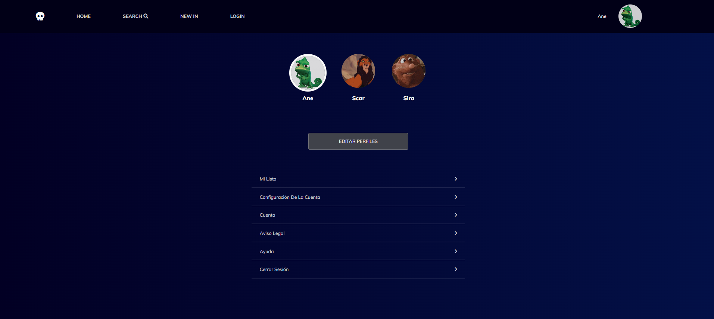

# Movie App
This React app based on Disney's App/Website design allows the user to log himself in by choosing their avatar and apply the whole CRUD to his list of favourite movies.

## Tech Stack
+ HTML 5
+ CSS 3
+ ES6
+ REACT

### Rest API
+ Mock API

### Version control
+ GIT
+ Git Hub

### Development tools & libraries
+ Visual Studio Code
+ Postman
+ Axios

## Objectives
The objective of this project is to put in practice the CRUD operations in the user favourite movies' by combining the front-end tech stack with the mockAPI which works as a Rest API that enables the app to download data.

## Features
### Favourite Movies CRUD
+ Publish a favourite movie
+ Update a favourite movie
+ Delete a favourite movie
+ Like a favourite movie
+ Display the whole list of favourite movies
+ Display a list of the liked favourite movies 
+ Display the favourite movie details

### User CRUD
+ Login
+ Register
+ Update his profile
+ Delete his profile
+ Search a movie by its title

### Design
+ Responsive Web Design
+ Modularity and Scalability (by using React components)

## Preview
### Desktop





### Mobile


## Installation

This project was bootstrapped with Create React App therefore requires node.js and npm.  Once you've verified node is installed in your directory take the following steps:

#### 1. Clone the repository
```bash
 git clone https://github.com/afonttorres/movie-app.git
```


#### 2. Run the app in development mode
```bash
 npm start
 ``` 
## Authors
+ [@afonttorres](https://github.com/afonttorres)

#### Contact me:

[Email](mailto:afonttorres@gmail.com)

[](https://www.linkedin.com/in/agnes-font-torres/)


